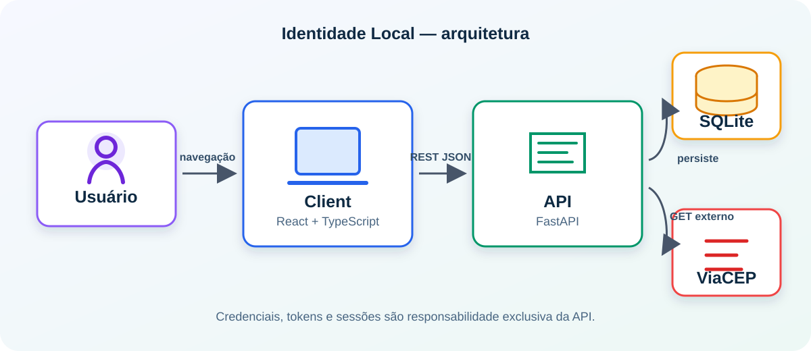

# Identidade Local — Interface

Interface React do sistema educacional **Identidade Local**. Permite cadastro,
login, preenchimento assistido de endereço, edição do perfil e administração de
sessões e chaves de API. Ela mantém o access token apenas em memória e delega autenticação,
persistência e ViaCEP à API FastAPI independente.

Também oferece a rota pública `/esqueci-minha-senha`. Ela solicita a recuperação
sem confirmar se o e-mail está cadastrado e, no ambiente de desenvolvimento,
permite informar o JWT temporário recebido para escolher uma nova senha. Em
ambientes que não sejam de desenvolvimento, a API não retorna token: o fluxo
não substitui uma recuperação real por e-mail.

## Arquitetura



O client concentra páginas, estado visual, rotas protegidas e chamadas HTTP em
`src/services`. A API é a fonte de verdade para usuários e sessões, enquanto
SQLite é acessado apenas por ela. O navegador nunca chama o ViaCEP diretamente.

## Tecnologias e estrutura

- React, TypeScript, Vite e React Router
- Fetch para a API REST e CSS responsivo

```text
src/
├── components/  # componentes reutilizáveis e layout
├── pages/       # cadastro, login, perfil e sessões
├── routes/      # rotas públicas e protegidas
├── services/    # cliente HTTP, token em memória e erros
└── types/       # contratos da API
```

## Instalação local

Requer Node.js 24 ou superior e npm.

1. Instale as dependências: `npm install`.
2. Copie `.env.example` para `.env`.
3. Configure `VITE_API_URL=http://localhost:8000` ou a URL da API disponível.
4. Inicie o ambiente: `npm run dev`.

O Vite disponibiliza a interface em `http://localhost:5173`. Inicie a API
separadamente conforme o README dela antes de usar cadastro, login ou CEP.

## Variáveis de ambiente

| Variável | Obrigatória | Descrição |
|---|---:|---|
| `VITE_API_URL` | Sim | URL pública da API, por exemplo `http://localhost:8000`. |

Somente variáveis com prefixo `VITE_` são expostas ao bundle. Não inclua
segredos, tokens ou chaves em `.env`; esse arquivo não deve ser versionado.

## Scripts e qualidade

| Comando | Descrição |
|---|---|
| `npm run dev` | Inicia o servidor de desenvolvimento. |
| `npm run build` | Verifica TypeScript e gera o build de produção. |
| `npm run lint` | Executa o Oxlint. |
| `npm run preview` | Serve localmente o build de produção. |

Execute `npm run lint` e `npm run build` antes da entrega. O build é gerado em
`dist/` e não substitui a API em execução.

## Contrato consumido pela interface

As requisições usam JSON e `credentials: include` para que o cookie `HttpOnly`
de refresh seja enviado somente à API configurada. A interface utiliza os quatro
métodos REST requeridos:

| Método | Rota | Uso na interface |
|---|---|---|
| `POST` | `/auth/register` | Cria a conta. |
| `POST` | `/auth/login` | Inicia sessão e recebe access token. |
| `POST` | `/auth/api-key-login` | Permite integrações trocarem ID e segredo por access token. |
| `POST` | `/auth/refresh` | Renova o access token com cookie seguro. |
| `POST` | `/auth/logout` | Encerra a sessão atual. |
| `POST` | `/auth/forgot-password` | Solicita recuperação sem revelar a existência da conta. |
| `POST` | `/auth/reset-password` | Envia token temporário e nova senha; encerra sessões anteriores. |
| `GET` | `/users/me` | Exibe o perfil autenticado. |
| `PUT` | `/users/me` | Salva perfil e endereço. |
| `GET` | `/sessions` | Lista sessões ativas. |
| `DELETE` | `/sessions/{session_id}` | Revoga a sessão escolhida. |
| `POST` | `/api-keys` | Cria uma chave e apresenta o segredo uma única vez. |
| `GET` | `/api-keys` | Lista metadados das chaves criadas. |
| `DELETE` | `/api-keys/{key_id}` | Revoga uma chave. |
| `GET` | `/addresses/lookup/{zip_code}` | Preenche o endereço a partir do CEP. |
| `GET` | `/health` | Verifica disponibilidade da API quando necessário. |

Rotas protegidas recebem `Authorization: Bearer <access_token>`. Respostas de
erro trazem `detail`; a interface apresenta feedback de carregamento, sucesso
ou erro e preserva a edição manual do endereço quando a busca de CEP falha.

## Chaves de API

Na área autenticada, **Chaves API** permite nomear uma integração, criar sua
credencial e revogá-la. O ID público e o segredo aparecem logo após a criação;
o segredo fica somente no estado efêmero dessa tela e desaparece ao fechá-la ou
recarregar a página. A API não permite recuperá-lo depois: armazene-o em um
gerenciador de segredos, nunca no código-fonte, no navegador ou em arquivos
versionados. Integrações usam `POST /auth/api-key-login` com `key_id` e
`secret` para obter um JWT Bearer curto.

## ViaCEP: rota, cadastro e condições de uso

O client **não acessa ViaCEP**. Para pesquisar CEP, chama
`GET /addresses/lookup/{zip_code}` da API própria; a API consulta e normaliza o
serviço público ViaCEP. A rota escolhida do provedor é
`https://viacep.com.br/ws/{cep}/json/` e não requer cadastro, chave de API ou
token.

Use a busca somente como auxílio para CEP brasileiro com oito dígitos, aguarde o
resultado e permita que o usuário corrija os campos retornados. A API limita
consultas por IP, e pode responder CEP inválido (`400`), não encontrado (`404`),
limite atingido (`429`) ou indisponibilidade externa (`503`). Nesses casos, o
cadastro e a edição permanecem possíveis com preenchimento manual.

## Dockerfile

O Dockerfile na raiz instala dependências com Node 24 Alpine e inicia Vite na
porta 5173. Na raiz deste repositório, construa com
`docker build -t identidade-local-client .` e execute com
`docker run --rm -p 5173:5173 identidade-local-client`. Para outra URL de API,
forneça `VITE_API_URL` durante a construção ou use o Compose de desenvolvimento.

## Docker Compose

Este repositório contém o Compose integrado. Mantenha os repositórios `client`
e `api` lado a lado, copie `../api/.env.example` para `../api/.env` e defina
`JWT_SECRET_KEY` seguro. Na raiz do client, execute
`docker compose up --build`.

O Compose constrói a API usando `../api`, expõe client em
`http://localhost:5173` e API em `http://localhost:8000`, além de preservar o
SQLite no volume `api_data`. Ele é uma conveniência de desenvolvimento: ambos
os componentes também podem ser criados e executados separadamente por seus
Dockerfiles.

## Licença

Projeto acadêmico.
